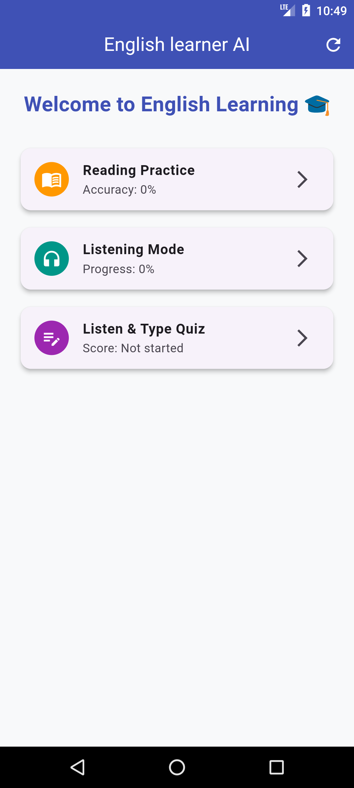
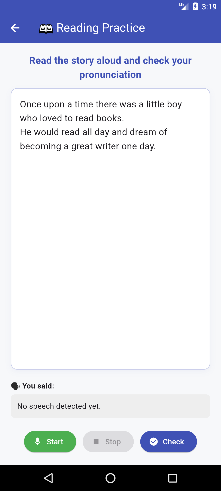
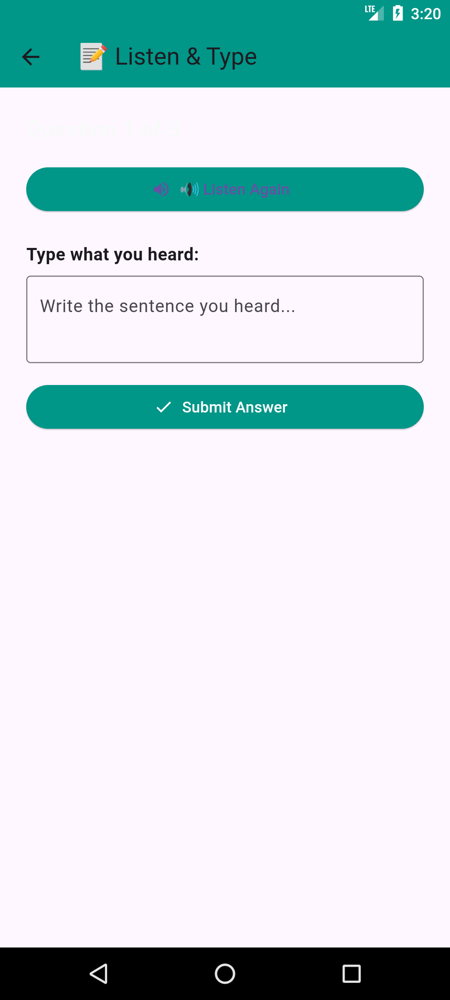
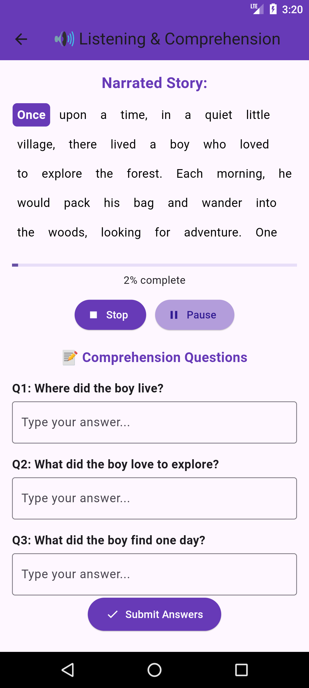

# 📚 AI-Based Offline English Learning App

  
  


> An interactive **offline mobile application** to help students practice English **reading, listening, and comprehension** skills — with real-time feedback, quizzes, and narration. Built using **Flutter**, **Text-to-Speech (TTS)**, and **Speech-to-Text (STT)** plugins.


## ✨ Features

- 🎤 **Reading Practice**
  - Speak the story aloud
  - Get instant feedback on correct and incorrect words (color-coded)

- 🔊 **Listening Mode**
  - Narrates stories with **highlighted word tracking**
  - Progress bar and comprehension questions included

- 📝 **Listen & Type Quiz**
  - TTS plays sentences
  - User types what they heard
  - Accuracy checked instantly

- 📈 **Progress Tracking**
  - Tracks performance across all modules
  - Reset or continue session-wise

- 🚀 **Fully Offline**
  - No internet required after installation
  - Ideal for low-resource schools and remote learners

---

## 📱 Screenshots
##Home Screen



| Reading Feedback | Listen & Type | Story Narration |
|------------------|---------------|-----------------|
|  |  |  |


## 🧱 Tech Stack

| Technology      | Usage                        |
|----------------|------------------------------|
| **Flutter**     | UI & mobile app framework    |
| **Flutter TTS** | Offline narration (TTS)      |
| **Speech Plugin** | Speech recognition (STT)   |
| **Dart**        | App logic                    |
| **AssetBundle** | Local story file handling    |


## 🛠️ How to Run

```bash
https://github.com/Mafia-Deadend/Ai-Based-English-Learning-Ap-TTS-and-STT-.git
cd Ai-Based-English-Learning-Ap-TTS-and-STT-
flutter pub get
flutter run
````

> Make sure your `assets/stories/story_1.txt` file exists and is declared in `pubspec.yaml`.

---

## 🎯 Target Audience

This app was designed for:

* Students (ages 8–18)
* Non-native English learners
* Schools and madrassas with **limited internet access**
* Self-learners looking to improve spoken English

---

## 📄 License

This project is licensed under Hammad_projects .
See [LICENSE](LICENSE) for more information.

---

## 👨‍💻 Author

**Muhammad Hammad**
Bachelor's Final Year Project – Dept. of Computer Science
University of Peshawar
[LinkedIn Profile](https://www.linkedin.com/in/your-profile) (optional)

---

## 🌟 Star this repo if you found it useful!


